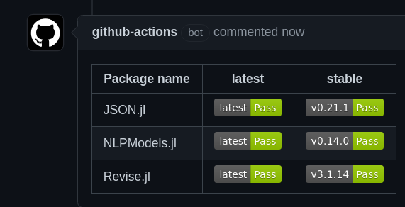

# Breakage tests for Julia

This is a workflow to test a list of packages when you make a pull request, so you know if the changes you're making so this package break the packages that depend on it.
When the tests are done, you'll receive a comment on the PR like this:

Don't worry about Revise.jl being broken there, it's just an example.

## Clarifications

- Use this workflow on your most core packages to test your dependent packages.
- This workflow should work even if the pull request is from outside the repo.
- The GitHub action shouldn't fail even if the package breaks something. Instead, the badge will be . See [PR#2](https://github.com/abelsiqueira/Breakage/pull/2) for example.
- Both `latest` and `stable` work similarly: download the package, `dev` the PR, and `test` the package.
- The `latest` test will clone the package using the full url. So the default branch of the repository is used.
- The `stable` test will clone the package and checkout the latest tag. It won't use `pkg> add` to prevent `Pkg` from resolving conflicts.
- It should work on any branch because it's activate by a pull-request.
- `CommentPR.yml` can't be modified during the pull request, i.e., changes to it won't be in effect until after the PR is merged.
- `Breakage.yml` can be modified, you can change the packages on `Breakage.yml`, make a pull request, and see the new version in action ([Example](https://github.com/abelsiqueira/Breakage/pull/1)).
- It only works on Julia packages, because it will `dev` into it. That's why this is a julia package.
- This is failing on Revise by design, because it becomes a circular dependency.

## Install

- Copy the files in `.github/workflows`.
- Modify [`Breakage.yml`](https://github.com/abelsiqueira/Breakage/blob/main/.github/workflows/Breakage.yml#L15) adding the packages you want tested.

## Where it's being used / Examples

- [NLPModels.jl](https://github.com/JuliaSmoothOptimizers/NLPModels.jl) and other packages of JuliaSmoothOptimizers.

Add your package to the bottom of the list by sending a PR.

## Wishlist / TODO

- The badge url should point directly to the Job, ideally to the test, better yet to the last line of the test action.

## License

